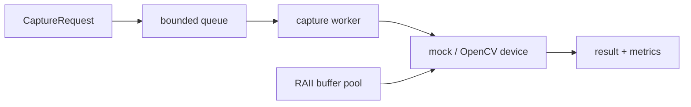

# Mini Camera HAL

A portable C++20 camera-system simulator inspired by request/result camera architectures. The project
is designed to demonstrate native systems engineering—not merely display webcam frames.

> This is an educational simulator. It does not implement Android Camera HAL, AIDL, Binder, or Pixel
> hardware integration.

## Highlights

- Typed capture requests, metadata, results, and status codes
- Move-only `FrameBuffer` with checked allocation sizing
- Hardware-independent `ICameraDevice` boundary
- Deterministic synthetic camera for reproducible tests
- Session-level request validation and exception containment
- Producer-consumer request pipeline with a dedicated capture worker
- Bounded queue with block, reject-newest, and drop-oldest policies
- Draining shutdown that wakes blocked producers and consumers
- Callback exception containment and observable async counters
- Reusable buffer pool with shutdown-safe RAII leases and high-water metrics
- Manual RGB-to-grayscale, gamma correction, and bilinear resize stages
- Optional OpenCV webcam and video-file adapter behind a PImpl boundary
- FPS and mean/P50/P95/P99/max capture latency
- CMake/CTest project with warning and sanitizer options
- GitHub Actions release and ASan/UBSan builds
- Seventeen behavioral tests, including concurrent delivery and buffer lifetime



See [architecture](docs/architecture.md) for ownership decisions and [roadmap](docs/roadmap.md) for
the piece-by-piece build plan. The exact checks run for this milestone are in the
[verification record](docs/verification.md). Measured optimization results and methodology are in
the [performance study](docs/performance.md).

## Build

Requirements: CMake 3.20+ and a C++20 compiler.

```bash
cmake -S . -B build -DCMAKE_BUILD_TYPE=Debug
cmake --build build --parallel
ctest --test-dir build --output-on-failure
./build/mini_camera_hal --frames 5
```

With OpenCV installed, use a webcam or video file:

```bash
./build/mini_camera_hal --source webcam --device 0 --frames 100
./build/mini_camera_hal --video samples/input.mp4 --frames 100
```

When OpenCV is unavailable, CMake prints that the adapter is disabled and the deterministic mock
source remains fully operational. Requesting a webcam/video source from such a build returns a clear
runtime error.

AddressSanitizer and UndefinedBehaviorSanitizer:

```bash
cmake -S . -B build-asan -DMCH_ENABLE_ASAN=ON -DCMAKE_BUILD_TYPE=Debug
cmake --build build-asan --parallel
ctest --test-dir build-asan --output-on-failure
```

ThreadSanitizer is configured separately with `-DMCH_ENABLE_TSAN=ON` for the asynchronous milestone.

For a constrained Linux environment without CMake or OpenCV:

```bash
./scripts/build_direct.sh
MCH_SANITIZE=address ./scripts/build_direct.sh
```

## Demo output

Each captured frame reports its request identity, owned buffer identity, byte size, latency, and a
deterministic checksum. The summary reports FPS, latency percentiles, dropped/rejected requests, and
buffer-pool capacity, acquisitions, and high-water usage.

## Benchmarks

On the recorded GCC 13.3 / AMD EPYC runtime, reusable buffering reduced median 1080p full-frame-fill
time from **70.228 ms to 34.285 ms (2.05x)** and reduced frame allocations from **500 to 1**. A
fixed-point grayscale kernel reduced 100-frame processing time from **755.517 ms to 182.494 ms
(4.14x)**. These are workload-specific results; see [performance.md](docs/performance.md) for the
methodology, limitations, and reproduction commands.

## Architecture note

The synchronous `CameraSession` remains the semantic engine under `AsyncCameraSession`. This keeps
request validation, ownership, and device error mapping independent from scheduling. The worker owns
the only device access path, so frame order is deterministic in the current single-worker model.

## License

MIT
