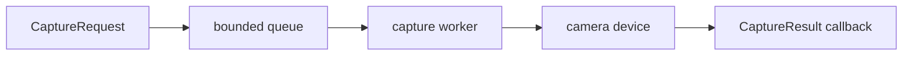

# Mini Camera HAL

A portable C++20 camera-system simulator inspired by request/result camera architectures. The project
is designed to demonstrate native systems engineering—not merely display webcam frames.

> This is an educational simulator. It does not implement Android Camera HAL, AIDL, Binder, or Pixel
> hardware integration.

## Current milestone: bounded asynchronous capture

- Typed capture requests, metadata, results, and status codes
- Move-only `FrameBuffer` with checked allocation sizing
- Hardware-independent `ICameraDevice` boundary
- Deterministic synthetic camera for reproducible tests
- Session-level request validation and exception containment
- Producer-consumer request pipeline with a dedicated capture worker
- Bounded queue with block, reject-newest, and drop-oldest policies
- Draining shutdown that wakes blocked producers and consumers
- Callback exception containment and observable async counters
- CMake/CTest project with warning and sanitizer options
- Eleven behavioral tests, including concurrent delivery and shutdown



See [architecture](docs/architecture.md) for ownership decisions and [roadmap](docs/roadmap.md) for
the piece-by-piece build plan. The exact checks run for this milestone are in the
[verification record](docs/verification.md).

## Build

Requirements: CMake 3.20+ and a C++20 compiler.

```bash
cmake -S . -B build -DCMAKE_BUILD_TYPE=Debug
cmake --build build --parallel
ctest --test-dir build --output-on-failure
./build/mini_camera_hal --frames 5
```

AddressSanitizer and UndefinedBehaviorSanitizer:

```bash
cmake -S . -B build-asan -DMCH_ENABLE_ASAN=ON -DCMAKE_BUILD_TYPE=Debug
cmake --build build-asan --parallel
ctest --test-dir build-asan --output-on-failure
```

ThreadSanitizer is configured separately with `-DMCH_ENABLE_TSAN=ON` for the asynchronous milestone.

For a constrained Linux environment without CMake:

```bash
./scripts/build_direct.sh
MCH_SANITIZE=address ./scripts/build_direct.sh
```

## Demo output

Each captured frame reports its request identity, owned buffer identity, byte size, latency, and a
deterministic checksum. Later milestones will add live aggregate FPS and percentile metrics.

## Why synchronous capture still exists

The synchronous `CameraSession` remains the semantic engine under `AsyncCameraSession`. This keeps
request validation, ownership, and device error mapping independent from scheduling. The worker owns
the only device access path, so frame order is deterministic in the current single-worker model.

## License

MIT
