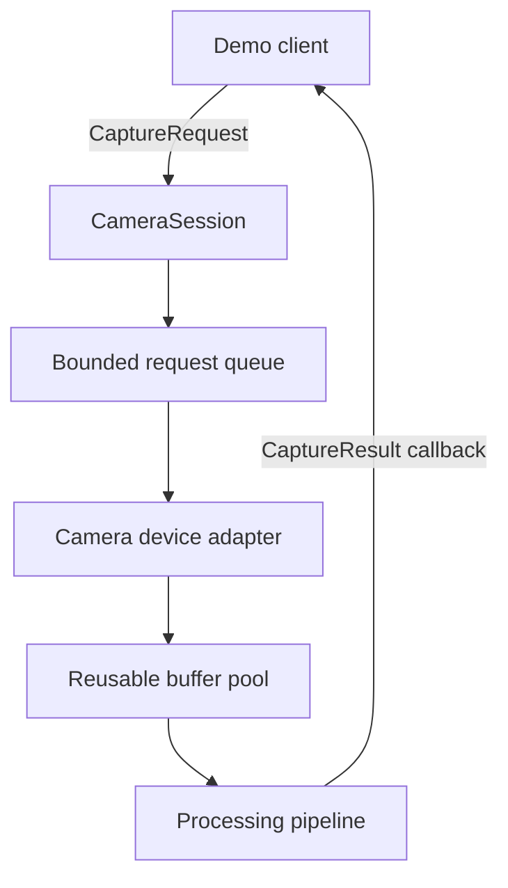
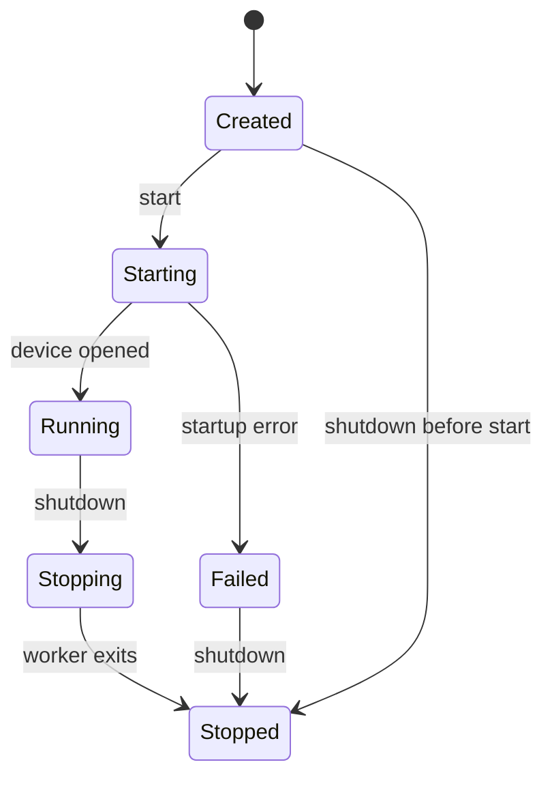

# Architecture

## What this project demonstrates

Mini Camera HAL is a portable camera-system simulator for demonstrating production-oriented C++
engineering: request/result APIs, explicit buffer ownership, asynchronous execution, backpressure,
latency measurement, and recovery from partial failure. It uses deterministic synthetic frames so
core behavior remains testable without camera hardware.

It is inspired by camera HAL concepts but does **not** implement Android Camera HAL, AIDL, Binder, or
device-specific drivers.

## Target architecture



The synchronous engine implements this boundary:

```text
CaptureRequest -> CameraSession -> ICameraDevice -> FrameBuffer -> CaptureResult
```

That gives later concurrency work a tested semantic baseline.

`AsyncCameraSession` now places a bounded `RequestQueue` in front of that engine. A dedicated worker
drains accepted requests and moves each result into the client callback. Callback exceptions are
contained and counted so consumer failure cannot silently terminate capture.

Shutdown is cancellation-aware: new submissions are rejected, queue and buffer-pool waiters wake,
and queued requests are returned as failed results when buffer acquisition has been cancelled. An
external caller joins the worker before final close. If shutdown originates inside the worker's
result callback, it signals cancellation and returns without self-joining; a later external call or
the destructor performs the join.

## Lifecycle



Sessions are intentionally non-restartable. `start()` is accepted only from `Created`; calls from
`Running`, `Stopped`, or `Failed` return `false`. Recreating a session also recreates its terminal
queue and buffer-pool state.

## Ownership model

`FrameBuffer` remains non-copyable. Without pooling, a device returns it through shared result
ownership. With pooling, `BufferPool::acquire()` returns an RAII lease implemented as a `shared_ptr`
with a custom deleter. Destroying the final result reference returns the buffer automatically.

The deleter retains the pool's shared state, so a lease remains valid even if the `BufferPool` facade
has already been destroyed. Pool shutdown wakes blocked acquirers and prevents new leases.

## Boundary validation

`CameraSession` validates every request before calling a device. It rejects zero/oversized
dimensions, invalid frame IDs, invalid exposure/gain, and incompatible YUV420 dimensions. Device
exceptions are converted into typed capture failures so hardware adapters cannot crash the demo.

## Design decisions

- OpenCV remains optional and is isolated in the device adapter; the domain types expose no OpenCV
  objects.
- Deterministic pixel generation makes correctness checks reproducible.
- Synchronous capture comes first to define behavior before thread scheduling complicates failures.
- Status codes and messages are both returned: code for control flow, message for diagnosis.
- Maximum resolution is bounded at the session boundary to prevent accidental giant allocations.
- OpenCV is isolated in an adapter and PImpl; the core API does not expose OpenCV types.
- Metrics retain a configurable rolling window (4,096 samples by default) while frame and elapsed
  counters cover the full run. Snapshot sorting is therefore bounded in both memory and CPU cost.
